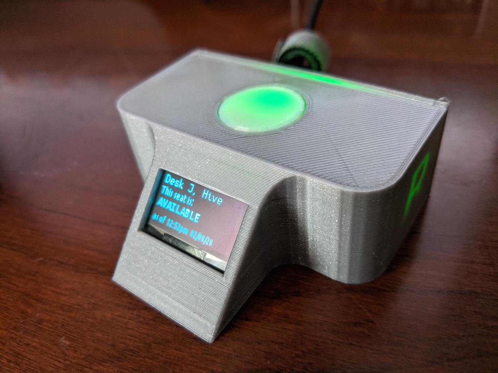
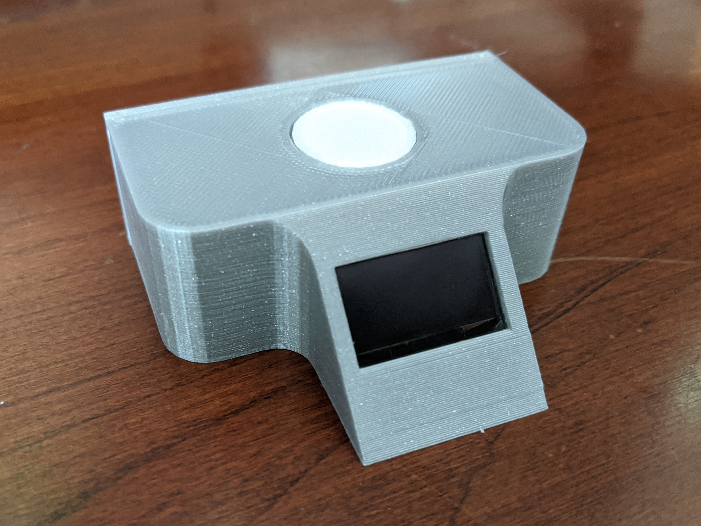
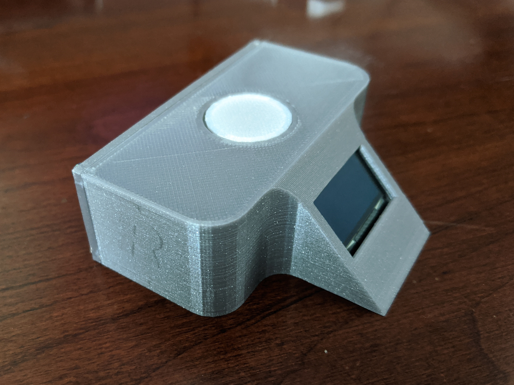
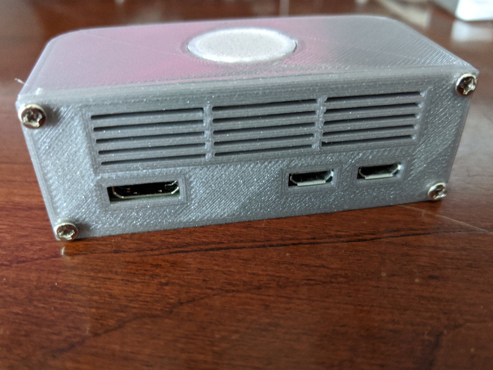
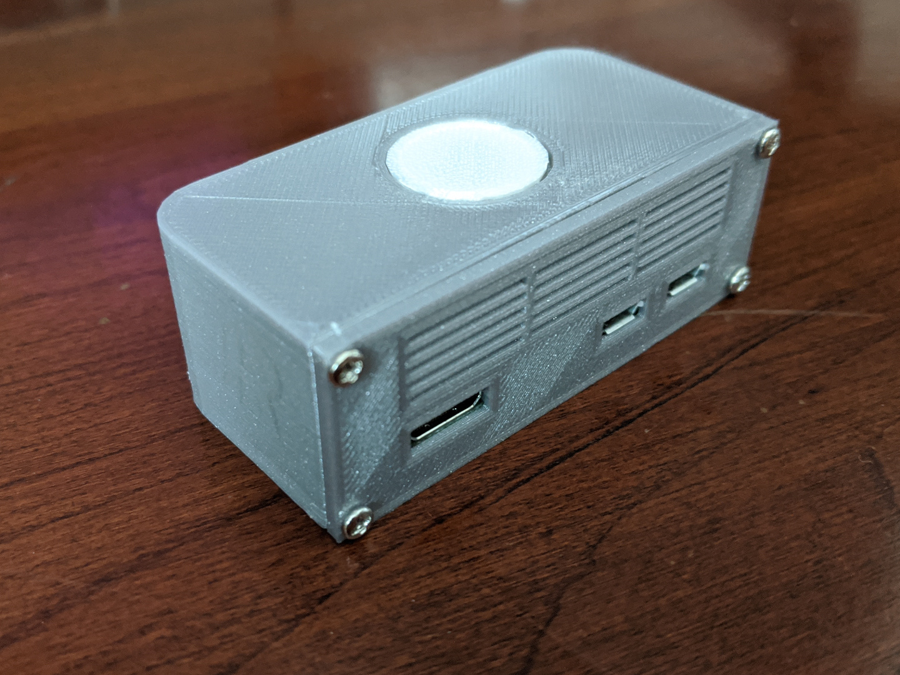
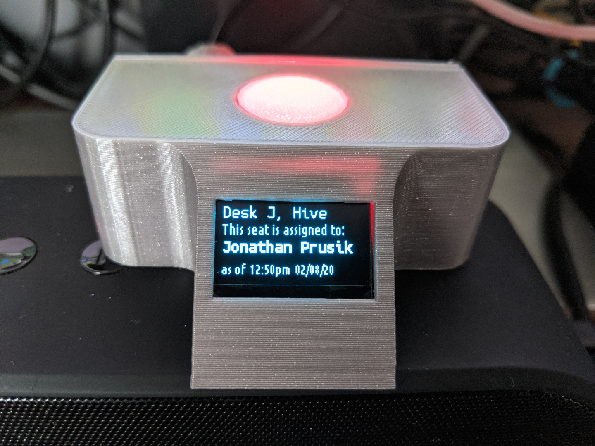
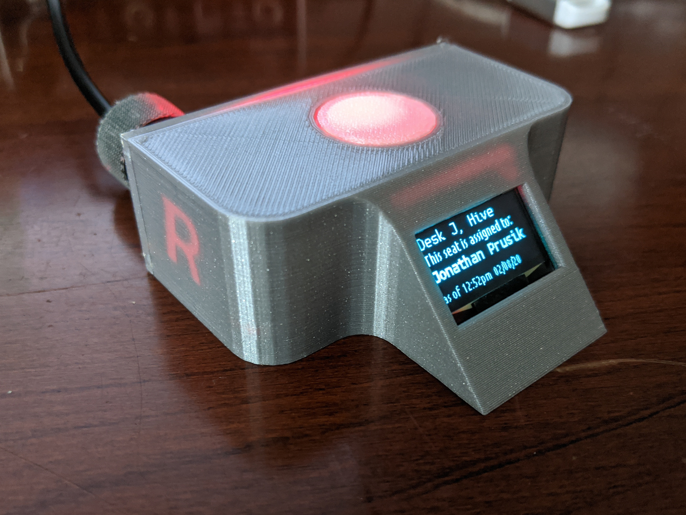
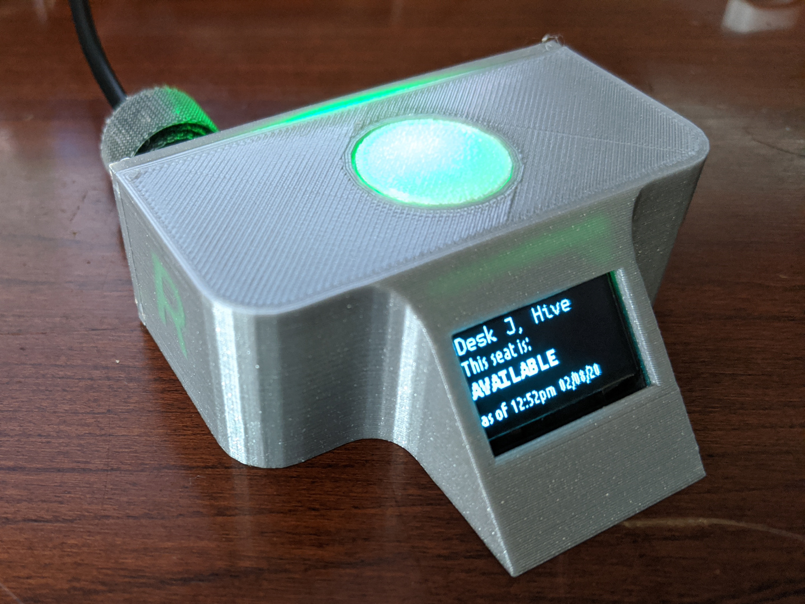

# Desk Status Device

One common issue, especially in large office layouts and locations utilizing hot-desking, is the difficulty employees navigating their workplaces. In particular, tracking down the right desk can be tricky, even with proper space mapping.

Expensive commercial solutions provide desk signage to help workers find the right desk, but for businesses that can't afford these or prefer not to be locked into a proprietary hardware ecosystem, there's an alternative: self-assembled, low-cost devices capable of a robust feature set.

This project aims to make it easy for anyone with a little technical inclination to build smart signage for their office desks in a cheap and scalable way. This particular configuration makes use of the [Robin platform](https://robinpowered.com/), which offers a myriad of office enhancements.
| | | | |
| --- | --- | --- | --- |
|  |  |  |  |
|  |  |  | |

## Features

- A small physical footprint means your device won't compete for desk space.
- An OLED screen allows for simple or dense information display with sharp clarity, without being distracting. Desk assignment and reservation details are easy to check without maps or apps.
- An onboard multicolor LED allows for a variety of RGB lighting blends, with smooth crossfading and color mixing capabilities. Signal statuses or temporary beacons for at-a-glance information nearby or at a distance.
- The entire configuration can be powered by the USB port of a computer or monitor - no special adapters or power units needed.

### Seat status changes with your management platform

### Use beacon signals let employees increase their desk's visibility as they search for it

### Shutdown sequence ensures no out-of-date information is provided when the device or desk is not active

## Components

These are the components used in the configuration shown above, but there's a lot of flexibility, depending on the features you'd like.

- 1x Enclosure (models are included in this project for 3D printing)
- 1x 0.96-inch OLED (128x64 resolution)
- 1x Raspberry Pi Zero (wifi variant means one less cable to worry about)
- (optional) 1x micro-USB LAN adapter (required for the non-wireless Raspberry Pi Zero variant)
- (optional) 1x 5mm RGB LED (required for status light features) and resistors
- 1x microSD card (4GB or more is sufficient)
- 8x Jumper cables or otherwise suitable wire
- 4x M2.5 screws (6mm to 16mm long)
- 1x set of header pins

## Model versions

If you are printing your own enclosure, there are a few different models available depending on your components and desired configuration.

If you plan to use an LED as a status light, be sure to use the `body-with-top-hole` model for the body of your desired variant.

Note, there are currently two model categories based on the form-factor of the OLED screen + board (both have 0.96-inch screens, however):

Smaller variant - OLED display with board measures at approximately 2.4 cm x 1.4 cm

Larger variant - OLED display with board measures at approximately 2.7 cm x 2.7 cm

Additionally, there is a version with the Robin logo cutout from the inside of the enclosure to allow illumination by the status light.

## Assembly

**Note:** This project covers the physical construction of your desk status device. For software installation and set up, see the [desk-status](https://github.com/jprusik/desk-status) project.

1. Before you begin soldering or attaching wires to your Raspberry Pi Zero, make sure all your components fit within the enclosure correctly. This is also a good opportunity to make a plan for wire management.
2. Connect Wires for the OLED display and LED to the Raspberry Pi Zero. The default configuration for this project assumes a common cathode, 4-pin LED diode, which requires resistors on each non-common leg (you may want to calculate the right resistor to use for your LED. The one in this project used 1x 56 ohms, 1/8W for Red LED, 2x 5.6 ohms, 1/8 W for Green and Blue LEDs). The wiring for this configuration is as follows:

    | Component Pin | Raspberry Pi Pin |
    | --- | --- |
    | OLED GND | 6 / Ground |
    | OLED VDD / VCC | 1 / 3V3 (Power) |
    | OLED SCK | 5 / GPIO3 / SCL1 |
    | OLED SDA | 3 / GPIO2 / SDA1 |
    | LED Red | 8 / GPIO14 |
    | LED Green | 10 / GPIO15 |
    | LED Blue | 7 / GPIO4 |
    | LED Common Ground | 9 / Ground |

    **Note:** Be sure to take note of your LED's GPIO pin numbers, as you'll need to reference them in your configuration during software setup.
3. Insert [the prepared microSD](https://github.com/jprusik/desk-status) into the Raspberry Pi Zero.
4. Insert the OLED display into the enclosure (depending on the enclosure you're using and how your header pins are configured, you may need to disconnect the OLED display cables temporarily; be sure to note their position and reconnect them once the screen is in).
5. Insert the Raspberry Pi Zero carefully into the enclosure. Be sure not to pinch any cables!
6. Insert LED into LED bracket.
7. Arrange cables to minimize light path blockage.
8. Screw in backplate.
9. Plug your power source into the far right (outermost) micro-USB port.
